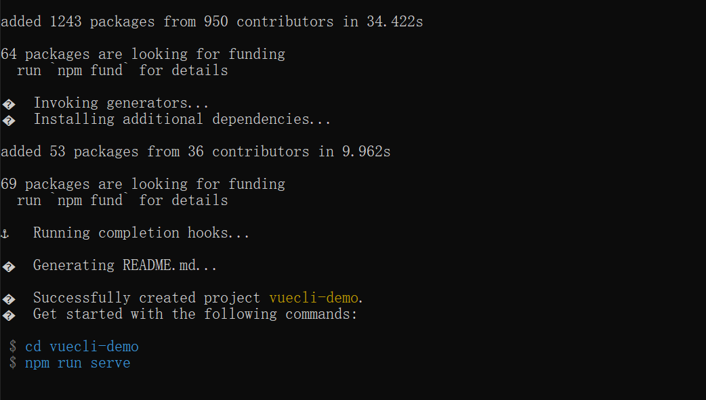

# 基础配置及指令

<!--more-->

## 1-搭建脚手架

(建议全局配置, 开箱即用 0配置)

### 1.新建文件夹(不能包含中文) cmd开启指令 

### 2.全局安装:

```cmd
yarn global add @vue/cli
# OR
npm install -g @vue/cli

#如果半天没反应,ctrl c 停止重来
```


查看版本:

```cmd
vue -V
# 出现版本号则表示安装成功
```


### 3.创建项目:

```cmd
# vue和create是命令, vuecli-demo是文件夹名
vue create vuecli-demo
```


### 4.选择模板:(`选错可以ctrl C 重来`)


### 5.选择什么方式下载脚手架依赖包:


### 6.回车等待生成项目文件夹+文件+下载必须的第三方包们



### 7.进入脚手架项目下, 启动内置的热更新本地服务器

```cmd
cd vuecil-demo

npm run serve
# 或
yarn serve
```


### 8.打开浏览器输入上述地址:

* 

  

  目录分析:

  ```cmd
  vuecil-demo        # 项目目录
     ├── node_modules # 项目依赖的第三方包
     ├── public       # 静态文件目录
       ├── favicon.ico# 浏览器小图标
       └── index.html # 单页面的html文件(网页浏览的是它)
     ├── src          # 业务文件夹
       ├── assets     # 静态资源
         └── logo.png # vue的logo图片
       ├── components # 组件目录
         └── HelloWorld.vue # 欢迎页面vue代码文件 
       ├── App.vue    # 整个应用的根组件
       └── main.js    # 入口js文件
     ├── .gitignore   # git提交忽略配置
     ├── babel.config.js  # babel配置
     ├── package.json  # 依赖包列表
     ├── README.md    # 项目说明
   	└── yarn.lock    # 项目包版本锁定和缓存地址
  ```

  

  

  主要文件及含义:
  
  ```js
    node_modules下都是下载的第三方包
    public/index.html – 浏览器运行的网页
    src/main.js – webpack打包的入口文件
    src/App.vue – vue项目入口页面
    package.json – 依赖包列表文件
  ```
  
  

==关闭eslint检查:==

在vue.config.js 里面 添加配置项 重启服务器

```js
module.exports = {
  lintOnSave: false, //暂时关闭eslint检查
  devServer: {
    // 自定义服务配置
    open: true, // 自动打开浏览器
    port: 3000
  }
}
```


## 2-vue基础指令:

`在vue中，通过数据驱动视图，不要在想着怎么操作DOM，而是想着如何操作数据！`

### 1) 插值表达式

插值表达式又叫: 声明式渲染/文本插值/大胡子语法

作用: 在dom标签中, 直接插入内容

语法: {{ 表达式 }}

### 2) v-bind

动态绑定:目标：给标签属性设置Vue变量的值

- 语法：`v-bind:属性名="vue变量"`
- 简写：`:属性名="vue变量"`

```vue
<!-- vue指令-v-bind属性动态赋值 -->
<a v-bind:href="url">我是a标签</a>

```

### 3) v-on:

作用:给标签绑定事件

#### 1:v-on语法

语法 :

* `v-on:事件名=“methods中的函数名" `

* `v-on:事件名=“methods中的函数名(实参)" `

简写: 

* `@事件名="methods中的函数"`

```vue
<!-- vue指令:   v-on事件绑定-->
<p>你要买商品的数量: {{count}}</p>
<button v-on:click="addFn">增加1个</button>
<button v-on:click="addCountFn(5)">一次加5件</button>

<button @click="subFn">减少</button> //v-on:可以简写成@

<script>
    export default {
        // ...其他省略
        methods: {
            addFn(){ 
                // this代表export default后面的组件对象(下属有data里return出来的属性)
                this.count++
            },
            addCountFn(num){
                this.count += num
            },
            subFn(){
                this.count--
            }
        }
    }
</script>
```

#### 2:v-on事件对象

作用: vue事件处理函数中, 拿到事件对象

语法:

* `无传参, 通过形参直接接收`
* `传参, 通过$event指代事件对象传给事件处理函数`

```vue
<template>
  <div>
    <a @click="one" href="http://www.baidu.com">阻止百度</a>
    <hr>
    <a @click="two(10, $event)" href="http://www.baidu.com">阻止去百度</a>
  </div>
</template>

<script>
export default {
  methods: {
    one(e){
      e.preventDefault()
    },
    two(num, e){
      e.preventDefault()
    }
  }
}
</script>
```

#### 3:v-on修饰符

作用: 事件.修饰符名 - 给事件带来更强大的功能

语法:

* `@事件名.修饰符="methods里函数" `

 修饰符列表 

* `.stop - 阻止事件冒泡 `

* `.prevent - 阻止默认行为`

```vue
 <!-- vue对事件进行了修饰符设置, 在事件后面.修饰符名即可使用更多的功能 -->
    <button @click.stop="btn">.stop阻止事件冒泡</button>
    <a href="http://www.baidu.com" @click.prevent="btn">.prevent阻止默认行为</a>
```

#### 4:v-on案件修饰符

作用:给键盘事件, 添加修饰符, 增强能力

语法: 

* `@keyup.enter - 监测回车按键 `
* `@keyup.esc - 监测返回按键`

```vue
<input type="text" @keydown.enter="enterFn">  //回车键触发
<input type="text" @keydown.esc="escFn">  //返回键触发
```

### 4) v-model:

作用: 把表单值和Vue变量双向绑定

基础阶段v-model只能用在表单元素上, 以后学组件后讲v-model高级用法

语法: `v-model="vue数据变量"`

双向数据绑定 :

* 变量变化 -> 视图自动同步
* 视图变化 -> 变量自动同步

#### 1:绑定input

```vue
<!--    v-model:是实现vuejs变量和表单标签value属性, 双向绑定的指令 -->
    <div>
      <span>用户名:</span>
      <input type="text" v-model="username" />
    </div>
```

#### 2:绑定其他表单标签

v-model绑定:select, checkbox, radio,  textarea:

```vue
<template>
  <div>
    <div>
      <span>来自于: </span>
      <!-- 下拉菜单要绑定在select上 -->
      <select v-model="from">
        <option value="北京市">北京</option>
        <option value="南京市">南京</option>
        <option value="天津市">天津</option>
      </select>
      <!-- (重要)
      遇到复选框, v-model的变量值
      非数组 - 关联的是复选框的checked属性
      数组   - 关联的是复选框的value属性 -->
      <span>爱好: </span>
      <input type="checkbox" v-model="hobby" value="抽烟">抽烟
      <input type="checkbox" v-model="hobby" value="喝酒">喝酒
      <input type="checkbox" v-model="hobby" value="写代码">写代码
    </div>
    <div>
      <span>性别: </span>
      <input type="radio" value="男" name="sex" v-model="gender">男
      <input type="radio" value="女" name="sex" v-model="gender">女
    </div>
    <div>
      <span>自我介绍</span>
      <textarea v-model="intro"></textarea>
    </div>
  </div>
</template>

<script>
export default {
  data() {
    return {
      from: "",
      hobby: [], 
      sex: "",
      intro: "",
    };
    // 总结:
    // 特别注意: v-model, 在input[checkbox]的多选框状态
    // 变量为非数组, 则绑定的是checked的属性(true/false) - 常用于: 单个绑定使用
    // 变量为数组, 则绑定的是他们的value属性里的值 - 常用于: 收集勾选了哪些值
  }
};
</script>
```


#### 3:v-model修饰符

作用:给v-model扩展额外功能

语法:

`v-model.修饰符="vue数据变量"`

* .number   以parseFloat转成数字类型
* .trim          去除首尾空白字符
* .lazy           在change时触发而非inupt时

```vue
<template>
  <div>
    <div>
      <span>年龄:</span>
      <input type="text" v-model.number="age">
    </div>
    <div>
      <span>人生格言:</span>
      <input type="text" v-model.trim="motto">
    </div>
    <div>
      <span>自我介绍:</span>
      <textarea v-model.lazy="intro"></textarea>
    </div>
  </div>
</template>

<script>
export default {
  data() {
    return {
      age: "",
      motto: "",
      intro: ""
    }
  }
}
</script>
```

### 5) v-html

作用:设置标签显示的内容

* 语法:
  * `v-html="vue数据变量"`
* 注意: 会覆盖插值表达式

```vue
<template>
  <div>
    <p v-html="str"></p>
  </div>
</template>

<script>
export default {
  data() {
    return {
      str: "<span>我是一个span标签</span>"
    }
  }
}
</script>
```

==v-html与插值表达式区别是什么？==

* 插值表达式把值当成普通字符串显示
* v-html把值当成标签进行解析显示

### 6) v-for 和 v-if

作用:控制标签显示与隐藏

* 语法:
  * `v-show="vue变量"     `       
  * `v-if="vue变量" `
* 原理(区别)
  * v-show 用的display:none隐藏   (频繁切换使用)
  * v-if  直接从DOM树上移除
* 高级
  * v-else使用

```vue
<template>
  <div>
    <h1 v-show="isOk">v-show的盒子</h1>
    <h1 v-if="isOk">v-if的盒子</h1>

    <div>
      <p v-if="age > 18">我成年了</p>
      <p v-else>还得多吃饭</p>
    </div>
  </div>
</template>

<script>
export default {
  data() {
    return {
      isOk: true,
      age: 15
    }
  }
}
</script>
```

### 7) v-for:

作用:循环遍历数据生成标签:

* 语法

  * `v-for="(值变量, 索引变量) in 目标结构"`
  * `v-for="值变量 in 目标结构"`

* 目标结构:

  * 可以遍历数组 / 对象 / 数字 / 字符串

* 注意:

  v-for的临时变量名不能用到v-for范围外

  同级标签的key值不能重复

#### 1:遍历数组

```vue
<template>
  <div id="app">
      <!-- v-for 把一组数据, 渲染成一组DOM -->
      <!-- 口诀: 让谁循环生成, v-for就写谁身上 -->
      <p>学生姓名</p>
      <ul>
        <li v-for="(item, index) in arr" :key="item">
          {{ index }} - {{ item }}
        </li>
      </ul>
  </div>
</template>

<script>
export default {
  data() {
    return {
      arr: ["小明", "小欢欢", "大黄"]
  }
}
</script>
```

#### 2:遍历数组内对象

```vue
<template>
  <div id="app">
      <!-- 省略其他 -->
      <p>学生详细信息</p>
      <ul>
        <li v-for="obj in stuArr" :key="obj.id">
          <span>{{ obj.name }}</span>
          <span>{{ obj.sex }}</span>
          <span>{{ obj.hobby }}</span>
        </li>
      </ul>
  </div>
</template>

<script>
export default {
  data() {
    return {
      // ...省略其他
      stuArr: [
        {
          id: 1001,
          name: "孙悟空",
          sex: "男",
          hobby: "吃桃子",
        },
        {
          id: 1002,
          name: "猪八戒",
          sex: "男",
          hobby: "背媳妇",
        }
      ]
    }
  }
}
</script>
```


