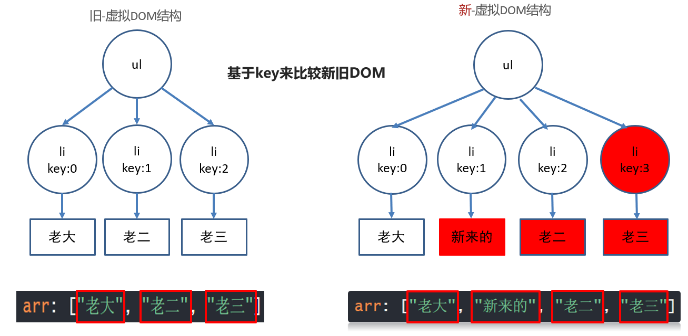

# vue基础属性

<!--more-->


## 1-虚拟DOM

概念:

.vue文件中的template里写的标签, 都是模板, 都要被vue处理成虚拟DOM对象, 在生成真实DOM片段, 才会渲染显示到真实DOM页面上

1. 内存中生成一样的虚拟DOM结构(==本质是个JS对象==)

   因为真实的DOM属性好几百个, 没办法快速的知道哪个属性改变了

   比如template里标签结构

   ```vue
   <template>
       <div id="box">
           <p class="my_p">123</p>
       </div>
   </template>
   ```

   对应的虚拟DOM结构

   ```js
   const dom = {
       type: 'div',
       attributes: [{id: 'box'}],
       children: {
           type: 'p',
           attributes: [{class: 'my_p'}],
           text: '123'
       }
   }
   ```

   1. 以后vue数据更新

      - 生成新的虚拟DOM结构
      - 和旧的虚拟DOM结构对比
      - 找不不同, 只更新变化的部分(重绘/回流)到页面 - 也叫打补丁

   ==好处1: 提高了更新DOM的性能(不用把页面全删除重新渲染)==

   ==好处2: 虚拟DOM只包含必要的属性(没有真实DOM上百个属性)==


## 2-key的作用:

### 目标

无key, 就地更新

有key为索引, 就地更新

有key为id, 对比新旧DOM, 无则创建/删除

### 1,无key - 就地更新

v-for不会移动DOM, 而是尝试复用, 就地更新，如果需要v-for移动DOM, 你需要用特殊 attribute `key` 来提供一个排序提示

```vue
<ul id="myUL">
    <li v-for="str in arr">
        {{ str }} 
        <input type="text">
    </li>
</ul>
<button @click="addFn">下标为1的位置新增一个</button>
```

```js
export default {
    data(){
        return {
            arr: ["老大", "新来的", "老二", "老三"]
        }
    },
    methods: {
        addFn(){
            this.arr.splice(1, 0, '新来的')
        }
    }
};
```

旧 - DOM结构  和  新 - DOM结构 对比过程


### 2,有key - 值为索引 - 就地更新

 - 还是就地更新

因为新旧虚拟DOM对比, key存在就复用此标签更新内容, 如果不存在就直接建立一个新的

```vue
<ul id="myUL">
    <li v-for="(str, index) in arr" :key="index">
        {{ str }} 
        <input type="text">
    </li>
</ul>
<button @click="addFn">下标为1的位置新增一个</button>
```

```js
export default {
    data(){
        return {
            arr: ["老大", "新来的", "老二", "老三"]
        }
    },
    methods: {
        addFn(){
            this.arr.splice(1, 0, '新来的')
        }
    }
};
```

图解:



1. v-for先循环产生新的DOM结构, key是连续的, 和数据对应

2. 然后比较新旧DOM结构, 找到区别, 打补丁到页面上

   最后补一个li, 然后从第二个往后, 都要更新内容

   ==口诀: key的值有id用id, 没id用索引==

### 3,有key - 值为id - 性能最高

key的值只能是唯一不重复的, 字符串或数值

v-for不会移动DOM, 而是尝试复用, 就地更新，如果需要v-for移动DOM, 你需要用特殊 attribute `key` 来提供一个排序提示

新DOM里数据的key存在, 去旧的虚拟DOM结构里找到key标记的标签, 复用标签

新DOM里数据的key存在, 去旧的虚拟DOM结构里没有找到key标签的标签, 创建

旧DOM结构的key, 在新的DOM结构里没有了, 则==移除key所在的标签==

```js
<template>
  <div>
    <ul>
      <li v-for="obj in arr" :key="obj.id">
        {{ obj.name }}
        <input type="text">
      </li>
    </ul>
    <button @click="btn">下标1位置插入新来的</button>
  </div>
</template>

<script>
export default {
  data() {
    return {
      arr: [
        {
          name: '老大',
          id: 50
        },
        {
          name: '老二',
          id: 31
        },
        {
          name: '老三',
          id: 10
        }
      ],
    };
  },
  methods: {
    btn(){
      this.arr.splice(1, 0, {
        id: 19, 
        name: '新来的'
      })
    }
  }
};
</script>

<style>
</style>
```

图解:

`总结: 不用key也不影响功能(就地更新), 添加key可以提高更新的性能`


## 3-Vue计算属性-computed

总结:`一个数据, 依赖另外一些数据计算而来的结果`

语法:

```js
  computed: {
      "计算属性名" () {
          return "值"
      }
  }
```

案例:需求: 求2个数的和显示到页面上

```vue
<template>
  <div>
    <p>{{ num }}</p>
  </div>
</template>

<script>
export default {
  data(){
    return {
      a: 10,
      b: 20
    }
  },
  // 计算属性:
  // 场景: 一个变量的值, 需要用另外变量计算而得来
  /*
    语法:
    computed: {
      计算属性名 () {
        return 值
      }
    }
  */
 // 注意: 计算属性和data属性都是变量-不能重名
 // 注意2: 函数内变量变化, 会自动重新计算结果返回
  computed: {
    num(){
      return this.a + this.b
    }
  }
}
</script>

<style>

</style>
```

## 4-vue监听器:

==想要侦听一个属性变化, 可使用侦听属性watch==

作用:`可以侦听data/computed属性值改变`

语法:

```js
watch: {
    "被侦听的属性名" (newVal, oldVal){
        
    }
}
```

完整例子:

```vue
<template>
  <div>
    <input type="text" v-model="name">
  </div>
</template>

<script>
export default {
  data(){
    return {
      name: ""
    }
  },
  // 目标: 侦听到name值的改变
  /*
  语法:
    watch: {
      变量名 (newVal, oldVal){
        // 变量名对应值改变这里自动触发
      }
    }
  */
  watch: {
    // newVal: 当前最新值
    // oldVal: 上一刻值
    name(newVal, oldVal){
      console.log(newVal, oldVal);
    }
  }
}
</script>

<style>

</style>
```

