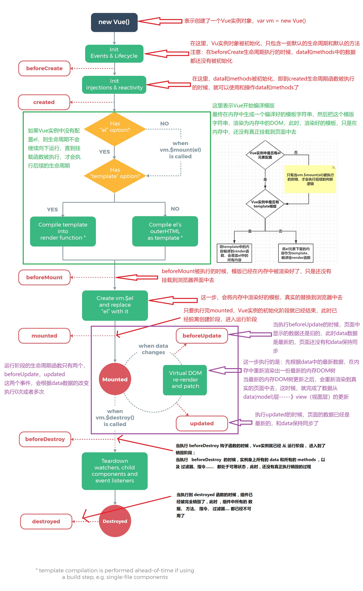

# vue的生命周期以及钩子函数:

<!--more-->

# 1-vue的生命周期:

`vue的生命周期从Vue实例, 创建到销毁的过程`

图解:

# 2-钩子函数:

## 1,概念:

**Vue** 框架内置函数，随着组件的生命周期阶段，自动执行

作用: 特定的时间点，执行特定的操作

## 2,分类

| **阶段** | **方法名**    | **方法名** |
| -------- | ------------- | ---------- |
| 初始化   | beforeCreate  | created    |
| `挂载`   | beforeMount   | mounted    |
| `更新`   | beforeUpdate  | updated    |
| 销毁     | beforeDestroy | destroyed  |

